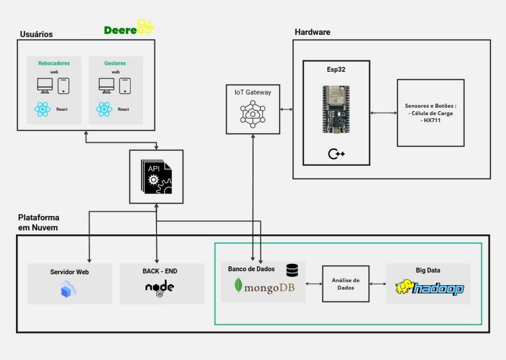
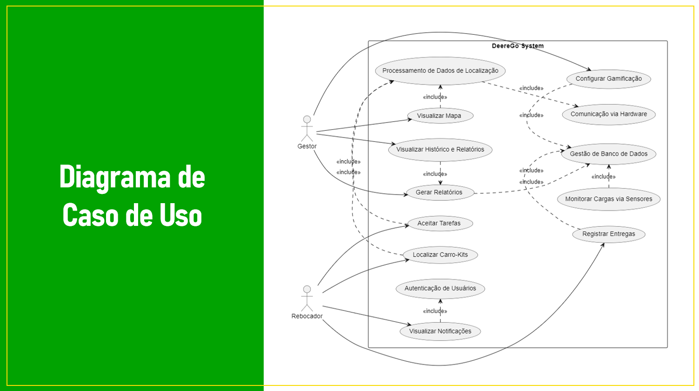
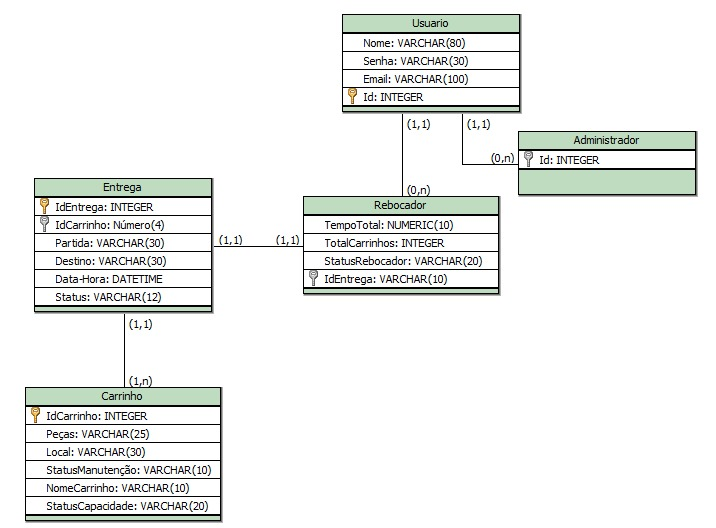
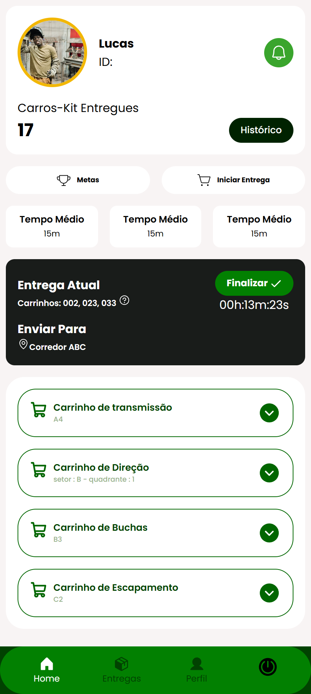
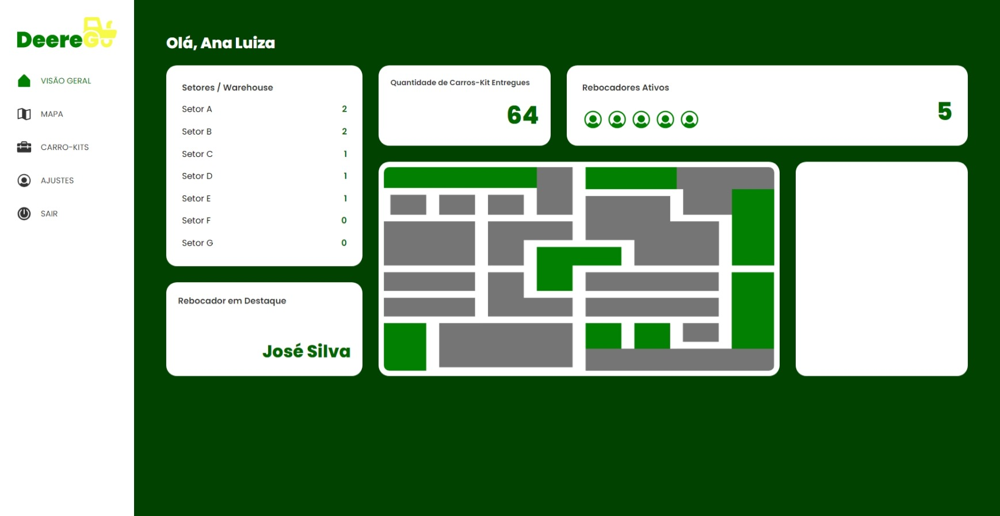
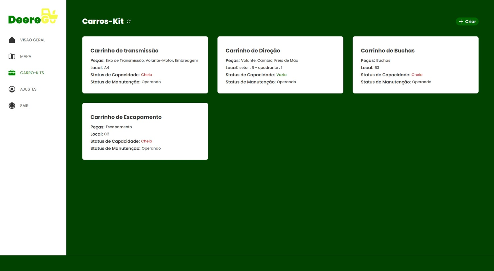

# Challenge John Deere - DEV4INNOVATION
## Sumário

- [Introdução](#introdução)
- [Desenvolvimento](#desenvolvimento)
  - [Arquitetura](#arquitetura)
  - [Estrutura Banco de Dados](#estrutura-banco-de-dados)
  - [Tecnologias](#tecnologias)
- [Funcionalidades e Resultados](#funcionalidades-e-resultados)
  - [Rebocador](#rebocador)
  - [Administrador](#administrador)
- [Código Fonte e Estrutura](#codigo-fonte-e-estrutura)
- [Autores](#autores)
- [Instalação](#react-+-typeScript-+-vite)
- [Stacks](#stacks)


## Introdução
O projeto busca melhorar a visibilidade e o controle das atividades de logística dentro da fábrica, otimizando o tempo e reduzindo erros no processo de entrega.


## Desenvolvimento
### Arquitetura

A arquitetura do sistema é baseada em uma solução IoT para localização e controle de um rebocador dentro de uma fábrica. Utilizamos um ESP32 para calcular a posição do rebocador, e essas coordenadas são enviadas para uma API desenvolvida em Node.js, que armazena os dados no banco de dados MongoDB. O front-end, construído em Vite.js com TypeScript, permite que o administrador visualize o andamento das entregas e o desempenho dos rebocadores.

- O ESP32 coleta dados de localização via RSSI dos roteadores presentes na fábrica, utilizando a fórmula de multilateração para determinar a posição do carro kit.
- O ESP32 envia os dados para uma API REST (Node.js) via Wi-Fi.
- A API processa os dados e os armazena no banco de dados MongoDB.
- O front-end consome esses dados e os exibe em um mapa, permitindo que o administrador veja a posição atual e as tarefas em andamento do rebocador.




### Estrutura Banco de Dados


### Tecnologias

As principais tecnologias envolvidas no projeto são:

- **Vite.js**: Framework para desenvolvimento front-end, escolhido pela sua rapidez e facilidade de configuração com TypeScript.
- **Node.js**: Servidor back-end que gerencia as requisições do ESP32 e do front-end.
- **MongoDB**: Banco de dados NoSQL utilizado para armazenar as coordenadas e informações do rebocador.
- **ESP32**: Dispositivo IoT responsável por calcular a posição do rebocador e enviar os dados.
- **TypeScript**: Usado no desenvolvimento do front-end e back-end, para maior consistência e manutenção do código.
- **C++**: Linguagem utilizada para programar o ESP32.

## Funcionalidades e Resultados


### Rebocador
- Controle de entregas realizadas
- Direcionamento de entregas a serem feitas
- Aplicativo Web voltado para o rebocador para auxiliar na locomoção de peças dentro da fábrica



### Administrador
- Controle das informações dos rebocadores
- Informações sobre o desempenho das atividades
- Aplicativo Web voltado para o administrador para visualizar o andamento das atividades realizadas pelos rebocadores




## Código Fonte e Estrutura
- O código-fonte do projeto está disponível na pasta `scr`.
- As imagens utilizadas no projeto estão organizadas na pasta `assets`.
- Link do vídeo demonstrativo: [YouTube](https://youtu.be/uc9tMSPD7P0)

## Autores

- [Ana Luiza Oliveira Dourado](https://www.linkedin.com/in/ana-dourado/)
- [Lucas Rodrigues Grecco](https://www.linkedin.com/in/lucasrgrecco/)
- [Monique Ferreira dos Anjos](https://www.linkedin.com/in/ferreira-monique/)
- [Felipe Wapf Fettback](https://github.com/FelipeFettback)
- [Ronaldo Veloso Filho](https://www.linkedin.com/in/ronaldoveloso/)

## Stacks
- [BACK-END - API](https://github.com/An4lu/DeereGO-Back)
- [FRONT-END - WEB APP](https://github.com/An4lu/DeereGO)
- [ESP](https://github.com/lucvs07/deereGO-ESP)

## Testes de Desempenho
### Definição da Ferramenta de Teste
#### Teste de Tempo de Resposta
Este teste avalia o tempo necessário para que o ESP32 receba e processe um sinal WiFi e forneça a localização do dispositivo rastreado. O objetivo é medir a latência de resposta para verificar a rapidez do sistema ao identificar dispositivos e fornecer atualizações em tempo real.

Ferramentas: Utilizamos um cronômetro digital para registrar o tempo entre o envio de um sinal e a resposta do ESP32.
Método: O ESP32 foi configurado para iniciar a leitura dos RSSID próximos. O tempo de resposta foi medido entre o momento de início da leitura e o retorno do posicionamento estimado.
#### Teste de Consumo de Energia
Este teste visa medir o consumo de energia do ESP32 durante o processo de rastreamento, verificando a viabilidade energética do dispositivo para aplicações de rastreamento prolongado.

Ferramentas: Utilizamos um multímetro digital para registrar o consumo de corrente do ESP32 em diferentes estados de operação.
Método: Foram realizadas medições de corrente em três estados:
Estado Ativo: Durante a leitura e triangulação de sinais WiFi.
Estado Ocioso: Quando o ESP32 estava em repouso entre leituras.
Estado de Baixo Consumo: Quando o ESP32 entrou em modo de economia de energia.

### Evidências de Testes
#### Teste de Tempo de Resposta
Teste	          Tempo de Resposta (ms) <br>
Teste 1	--------------- 120 <br>
Teste 2	--------------- 110 <br>
Teste 3	--------------- 130 <br>
Média	  --------------- 120 <br>
#### Teste de Consumo de Energia
Estado do ESP32	           Consumo Médio (mAh)<br>
Estado Ativo ------------------ 	 160<br>
Estado Ocioso -----------------  	80<br>
Estado de Baixo Consumo	-------- 20<br>
### Discussão dos Resultados
#### Teste de Tempo de Resposta
O tempo médio de resposta de 120ms mostrou-se satisfatório para o propósito do sistema, com uma latência que permite uma localização em tempo quase real. No entanto, em alguns casos, observou-se uma ligeira variação nos tempos de resposta, que pode ser causada por interferências de sinal ou carga do processador.
#### Teste de Consumo de Energia
O consumo de energia medido variou significativamente entre os estados de operação. No estado ativo, o consumo de 160mAh demonstra a necessidade de otimizar o código para reduzir a demanda energética, especialmente se o dispositivo for alimentado por bateria. O modo de baixo consumo apresentou uma economia relevante, possibilitando a viabilidade para rastreamento prolongado.
### Soluções Futuras
Para melhorar os testes e otimizar o desempenho do sistema, sugerimos as seguintes ações futuras:

- Otimização do Código: Implementar otimizações no código para reduzir o tempo de resposta e o consumo de energia, utilizando modos de economia de energia mais eficientes e aprimorando a gestão de threads de processamento.
- Filtragem de Sinais WiFi: Incorporar um filtro de sinais para mitigar interferências, o que poderia melhorar a precisão do tempo de resposta.
- Capacitor de Backup: Adicionar um capacitor de backup ao ESP32 para fornecer energia em caso de quedas, melhorando a consistência das medições de consumo.


# React + TypeScript + Vite

This template provides a minimal setup to get React working in Vite with HMR and some ESLint rules.

Currently, two official plugins are available:

- [@vitejs/plugin-react](https://github.com/vitejs/vite-plugin-react/blob/main/packages/plugin-react/README.md) uses [Babel](https://babeljs.io/) for Fast Refresh
- [@vitejs/plugin-react-swc](https://github.com/vitejs/vite-plugin-react-swc) uses [SWC](https://swc.rs/) for Fast Refresh

## Expanding the ESLint configuration

If you are developing a production application, we recommend updating the configuration to enable type aware lint rules:

- Configure the top-level `parserOptions` property like this:

```js
export default tseslint.config({
  languageOptions: {
    // other options...
    parserOptions: {
      project: ['./tsconfig.node.json', './tsconfig.app.json'],
      tsconfigRootDir: import.meta.dirname,
    },
  },
})
```

- Replace `tseslint.configs.recommended` to `tseslint.configs.recommendedTypeChecked` or `tseslint.configs.strictTypeChecked`
- Optionally add `...tseslint.configs.stylisticTypeChecked`
- Install [eslint-plugin-react](https://github.com/jsx-eslint/eslint-plugin-react) and update the config:

```js
// eslint.config.js
import react from 'eslint-plugin-react'

export default tseslint.config({
  // Set the react version
  settings: { react: { version: '18.3' } },
  plugins: {
    // Add the react plugin
    react,
  },
  rules: {
    // other rules...
    // Enable its recommended rules
    ...react.configs.recommended.rules,
    ...react.configs['jsx-runtime'].rules,
  },
})
```

